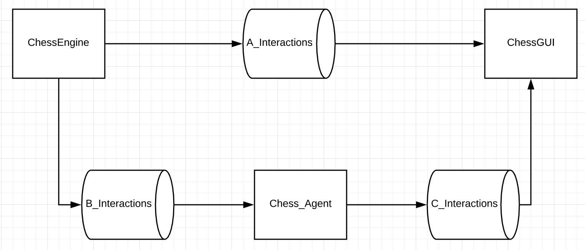

# Chess AI

#### High Level Overview:
 

##### A_interactions:
* What moves are available for a piece
* If the game is game over
* What pieces are available
* The game state is after a move occurs

##### B_interactions:
* What moves are available for a piece that Agent picks
* If the game is over
* What pieces are available

##### C_interactions:
* What move that the agent wants to perform (should be legal)

## chess_game.py

#### Basic Description:

This scripts handles the chess Engine. It handles what pieces are on the board, what moves that a player can do, whose turn it is,
and when a player has won or not. It also handles the movement of pieces after a desired move occurs

#### Classes/Methods and their description:

- What is the game state (pieces,board, and which turn it is):
Methods involved with getting the game state of the chess game
    - ChessGame.get_board(): returns a 2D array of what the pieces are on the board
    - ChessGame.get_pieces(player): returns a dict of pieces for a player
    - ChessGame.get_pcount(player): returns a dict of GamePieces and their count
    - ChessGame.check_game_over(): returns a boolean based off if the game is over or not

- What is next Moves: Checks to see if its game over -> compiles a list of pieces that you can move -> from the selected piece, returns a list of legal moves
    - ChessGame.get_moves(chess_piece_key): returns a list of coordinates that a selected piece can move to
    
- Move a selected Piece: Moves a piece and modifies the game state
    - ChessGame.move_piece(piece, new_coordinate): modifies the board with the piece movement, updates the pieces and piece count if necessary
    
- Classes:
    - GamePiece(Enum): this Enum class enumerates all the pieces, which is used for calculating what legal moves are available for peices. A *GamePiece* is the pieces used in the game_board variable
    - ChessGame(): initializes a fresh game board with the pieces where it should be in a normal chess game

- Helper Functions:
    - end_turn(): switches the **which_turn** variable to the opposite boolean. (if **which_variable** is true, then it is white's turn, else it is black's turn)
    - king_in_check(): checks to see if the current player's king is in check
    - move_check_check(): moves a piece and checks if the king is still in check
    - get_out_of_check(): provides moves that would get a person out of check
#### ToDo:
1. Refactor code so things aren't repeated based off of white or black player
## test_chess_game.py

#### Basic Description

This is the driver for the chess game. It utilizes pygame version 2.0.0.dev4. It handles the user mouse input and runs the game for 2 player chess.

#### ToDo:

## agents.py

#### Basic Description

This is a class that implements the different AI chess agents: MIN/MAX Agent, A* Agent, BellmanFord Agent, NN Agent

The Agent should take in a game state, create a tree with N depth and then spit out the move it wants to do

#### MIN/MAX:
* My understanding: the current state is the root of the tree. It then generates the possible moves. Considering how many moves ahead that the agent looks, (1 move means that the agent moves then the other person moves). It then picks the Max move while under the assumption that the other player will try to minimize 
* Game State: Dict of pieces
* State value: The value of the pieces (agent wants to max the difference between agent pieces and player pieces)
* Choice: look at the min max move choices and pick the best max value
* Try implementing alpha-beta pruning

#### ToDo:
1. diagram the search state for MIN / MAX

2. Create an Agent that picks from next search state at different lvls of looking down.